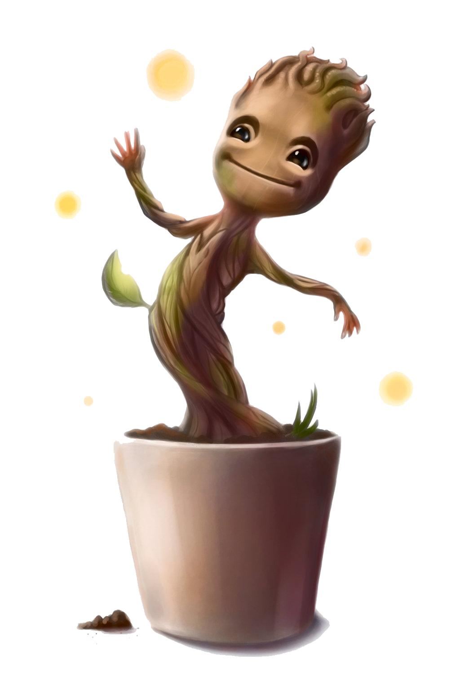

Hello! Welcome to my GitHub. I hope my work will be somewhat useful to you :)

<h3><u><b>Bio</b></u></h3>
<ul>
<li><b>Computational Biology PhD Candidate</b></li>
<li>Studied <b>BSc Biochemistry</b> and <b>MSc Bioinformatics</b></li>
</ul>

| Google Scholar |  [scholar.google.com/escasinas](https://scholar.google.com/citations?user=m6Y0gc4AAAAJ&hl=en&oi=ao) |
| ---------- | ---------- |

| Kaggle |  [kaggle.com/escasinas](https://www.kaggle.com/escasinas) |
| ---------- | ---------- |

<i>"I have no special talents. I am only passionately curious."</i><b> - Albert Einstein</b>
